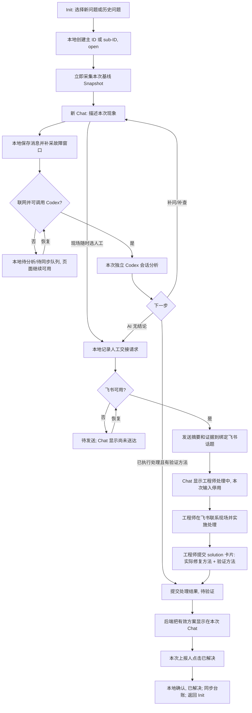

# 现场调试助手：软件设计需求文档

版本：v1.1｜日期：2026-09-15｜状态：需求基线，待工程评审

本文以已确认的三张图为依据：Bug 状态、处理流程、页面跳转。现场人员只使用本机支持入口；人工支持在飞书完成。本文描述目标产品的需求与架构。

## 1. 目标与边界

### 1.1 产品目标

1. 把现场求助统一收敛到 Chat 入口，替代临时在飞书中找工程师；现场人员只需选择新/历史问题并描述现象。
2. 故障出现时立即保存问题与环境证据，形成可追溯的处理和复盘记录，即使之后现象消失或网络中断。
3. 初期优先保证人工响应效率，预计约 95% 的问题由工程师主导解决；比例是评估假设，不作为产品配额。后续依据验证过的案例逐步提高 AI 独立处理能力。

### 1.2 运行条件

- 现场设备主要是 Linux 工控机或机器人，运行 Python、ROS2 和本仓库的驱动、遥操、控制路由与启动编排程序。
- 本地支持服务与业务软件进程分开运行。设备开机时**自启动最小本地服务**；图形会话可用后同时显示轻量前端浮窗，不展开完整 Chat、启动 Codex、建立飞书长连接或检查多维表格。
- 网络不稳定：建单、聊天、Snapshot 和状态确认先在本机持久化；飞书同步和 Codex 模型分析在联网后执行。
- 本地 Chat 触发的 Codex **严禁修改任何代码**：只允许读取已授权的代码、日志与环境证据并给出判断/步骤；不能写入源码、配置或脚本，不能提交、部署或执行修复。软件修改、重启、插线、模式切换及其他现场动作由人员执行。
- 不要求现场人员识别故障类别、看懂日志、操作 Git、阅读工程师群聊或填写技术表格。

### 1.3 第一版范围

包含本机 Init/History/Chat 界面、独立问题与 sub-ID、故障快照、联网后 Codex 多轮分析、飞书人工接管、工程师 solution 卡片、三态问题追踪、本地记录与多维表格同步、复盘资料。暂不包含自动发现并主动上报故障、机器人自动操作、自动改代码、无录音/纪要来源的普通电话转写，以及依据相似现象自动合并根因。

### 1.4 开机常驻与按需唤醒

开机自启动本地 API、SQLite/待处理队列、必要的运行日志能力和一个轻量前端浮窗。后台服务在系统启动后运行，浮窗在图形会话可用后出现；它只提供唤醒入口和少量本地状态，不预加载完整 Chat。本地服务待机时不启动模型进程、Snapshot 全量扫描、飞书长连接或多维表格定时检查。健康检查周期标记为**待定**：先支持启动、请求和任务失败时的事件式检查，再根据工控机资源实测决定是否需要低频周期检查及具体间隔。

现场点击浮窗才展开 Init/History/Chat，不调用模型。明确选择【新问题】或【历史问题】建单时先触发基线 Snapshot；收到本次现象后才启动该 ID 的 Codex 分析任务，现场直接选人工时不强制调用模型。断网先落盘并排队，网络恢复时只唤醒有待处理任务的队列。选择【找工程师】后才启动本机飞书连接并发送交接资料；人工问题未结束期间保持必要的回传能力，结束后释放连接。多维表格仅在建单、状态/方案变化、现场确认及待同步任务恢复时按事件写入，不常驻轮询台账。联网探测、重试和同步仅在存在待处理任务时运行，采用退避策略，不能把待机服务变成持续扫描器。

工程师卡片需要在本机断网、重启或连接断开时仍可回收：飞书侧接入/回调服务必须按问题 ID 持久化方案与事件。本机人工连接恢复或现场重新打开该问题 Chat 时按 ID 补拉最新版本，不能只依赖本机长连接收到的一次性事件；飞书侧接入服务不部署在机器人上，也不属于机器人开机常驻范围。

## 2. 角色与操作入口

| 角色 | 入口 | 可以做的事 |
| --- | --- | --- |
| 现场人员（本次上报人） | 本机 Init、History、Chat；人工阶段的飞书联系 | 选择新问题或历史问题，描述现象，查看 AI 答复或人工进展，收到方案后确认【已解决】 |
| 支持工程师 | 对应问题的飞书话题/群及 solution 卡片；多维表格台账 | 联系现场、排查和实施修复，填写修复方法与验证方法，查看证据与记录 |
| Codex | 本地采集与分析服务 | 分析本次问题证据、多轮对话、生成支持摘要及复盘草稿；不得替现场人员确认完成 |
| 飞书应用机器人 | 工程师群与卡片回调 | 传递现场摘要、将话题绑定问题 ID、接收 solution 卡片、把处理结果交给后端 |
| 支持负责人 | 多维表格 | 分派、跟踪超时、复盘和统计重复发生情况 |

## 3. 现场页面和跳转

现场端有一个常驻悬浮入口和三类展开后的页面；人工处理和待验证是 **Chat 页面状态**，不是独立的工程工作区。浮窗保持小尺寸、可拖动并记住位置，显示本地服务状态和未读方案提示；点击后展开 Init UI。收起时不占用键盘焦点，不拦截遥操或脚踏输入，也不能遮挡关键控制区域。

| 页面/状态 | 现场看到的内容 | 主要动作与跳转 |
| --- | --- | --- |
| 常驻浮窗 | 小型助手入口、本地服务状态、未读方案提示 | 点击展开 Init；收起展开面板后浮窗继续显示，不触发 Snapshot、模型或飞书连接 |
| Init UI | 本机设备与网络/采集状态；【新问题】【历史问题】 | 新问题：创建主 ID，进入空白 Chat；历史问题：进入 History |
| History UI | 本人可见的问题列表：ID、现象摘要、发生时间、状态 | 选择旧问题：先创建关联该旧问题的新 sub-ID，再进入**全新、空白** Chat；不延续旧聊天 |
| Chat UI：AI 处理 | 本次 ID、关联旧 ID（若有）、消息、保存/联网状态、Codex 回答 | 描述现象、多轮追问；可随时选择【找工程师】；【新问题】/【历史问题】转相应页面 |
| Chat UI：人工处理中 | 原问题 ID、已有现场消息、【工程师处理中】与真实送达/接手状态 | 该问题输入框停用；现场和工程师改在飞书沟通；本页只接收进展/结果 |
| Chat UI：待验证 | 工程师提交的修复方法和验证方法、【已解决】 | 本次上报人点击后保存确认，状态变为【已解决】，再返回 Init UI |

Chat 的关闭按钮只导航到 Init，不改变问题状态；面板收起时恢复为常驻浮窗。未解决的问题继续留在后台台账。历史列表的“选择旧问题再上报”总是创建新 sub-ID；若未来提供“查看旧记录”，须是单独的只读操作，不能与再次上报混用。新聊天可以是同一个 Chat 页面组件，但消息、Snapshot、Codex 会话及结论均按新 ID 隔离。

人工处理阶段现场**不在 Chat UI 继续聊天**。若方案未生效，现场通过飞书继续联系工程师，工程师更新或撤回 solution 卡片；Chat UI 只显示更新后的状态与方案。方案未获现场确认时不能因超时自动关闭。Chat 的【已解决】按钮只在有效 solution 到达、状态为【待验证】时显示，只允许本次上报人操作；旧版本卡片/重复点击不能重复确认。

## 4. 问题编号与状态

### 4.1 问题身份

- 【新问题】创建全局唯一主 ID，例如 `ISS-20260915-XXXXXXXX`，初始状态 `open`。
- History 选择旧问题时，原子分配 `主ID-S001`、`主ID-S002` 等新 sub-ID，初始状态 `open`。每个 sub-ID 是独立上报，保存 `parent_id`，有自己的聊天、Snapshot、Codex 会话、方案和确认结果。
- 若历史列表选中的是已有 sub-ID，后台先解析其 `root_id`，仍在主 ID 下分配下一个 `-Sxxx`，不形成多层嵌套；新记录同时保留用户具体选择的旧记录 ID 作为参考来源。
- 旧问题的摘要可供 Codex 参考，但不是本次现场证据；不能直接继承旧根因、旧状态或旧会话。
- ID 必须在联网和模型调用前本地落盘；重复点击、事件重送或重启不能创建第二个相同问题。离线只能选择本地已缓存的历史问题；若旧问题未缓存，应先以新问题上报，联网后由工程师关联，不凭猜测生成 sub-ID。

### 4.2 每次上报的三个状态

| 状态 | 含义 | 谁触发进入 |
| --- | --- | --- |
| `open` | 上报已建立，正在采集、AI 分析或工程师处理 | 创建新 ID/sub-ID；待验证处理失败时由工程师依据飞书反馈退回 |
| `待验证` | 修复动作已执行，处理方提交实际修复方法及现场验证方法，等待上报人确认 | 工程师 solution 卡片；AI 路径也须记录已执行的处理动作与验证方法 |
| `已解决` | 本次上报人明确确认问题已恢复 | 只由本次上报人在 Chat UI 点击【已解决】 |

门禁：`open → 待验证` 时，**实际修复方法和验证方法均不能为空**。只给出猜测、排查计划或尚未执行的操作，不满足门禁。代码修改、重启、插线、配置调整都按实际动作记录；代码变更另附分支、commit 和部署版本。`open → 已解决` 禁止。`待验证 → open` 需记录失败现象、反馈来源与 solution 版本；人工阶段在飞书反馈，由工程师更新状态，不要求现场返回 Chat 输入。所有状态变更追加事件，保留操作者、时间、来源与前后状态。

【人工处理中】【等待联网】【Codex 分析中】是独立的支持进展字段，不增加 Bug 状态。工程师提交 solution 只到【待验证】，飞书“聊天结束”、代码提交、AI 回答以及现场临时恢复都不能自动关闭问题。

### 4.3 主问题与 sub-ID 的汇总状态

主问题自身的历史处理结果与整个问题族的当前状态分开保存。新 sub-ID 为 `open` 时，主问题的**汇总状态**显示 `open`，表示再次发生；其之前【已解决】的方案和确认事件不被覆盖。只要任一关联 sub-ID 是 `open` 或【待验证】，主问题汇总为 `open`；全部 sub-ID 经各自现场人员确认【已解决】，且主问题自身的原始上报已解决时，主问题汇总恢复【已解决】。主问题自身尚未解决时，不能因为子问题关闭而显示整体已解决。多维表格主问题行的“状态”显示汇总状态，sub-ID 行显示本次上报状态；后台仍保留两者独立字段和变更依据。

## 5. 端到端处理流程

下图从现场明确建单开始，表示问题处理流程；开机常驻范围与按需唤醒规则见 1.4 节。图中的联网恢复只处理已经存在的待办任务，不触发空闲时的模型、飞书或台账轮询。



人工升级可由现场随时发起，不等待 AI 排查完成；团队初期应能以此承接大多数问题。切人工是对该问题的**处理渠道交接**：停止向现场 Chat 继续发送排查追问，按需建立飞书连接，飞书成为工程师与现场的沟通渠道。交接前已排队的 AI 回答可留在后台时间线，但不再推送到该问题 Chat，也不能自动推进状态。若升级时断网，先本地记录请求和待发送摘要；联网后只重试这项待办，页面要区分“尚未送达”与“工程师处理中”，不能把排队当成接单。

## 6. 功能需求

| 编号 | 要求 | 验收结果 |
| --- | --- | --- |
| FR-01 | 明确选择【新问题】或【历史问题】后才建单；普通咨询不写 Bug 台账 | 每次点击生成一个正确 ID，文字不会混入其他问题 |
| FR-02 | 选择历史问题后创建独立 sub-ID，进入空白 Chat | 旧消息不出现在新窗口；父问题 ID 和本次 ID 关联可查 |
| FR-03 | 建单与入站消息本地先持久化，Snapshot 在问题建立/首次描述后立即触发，不依赖网络 | 断网时仍有 ID、原始消息与采集结果/缺失标记 |
| FR-04 | 同一 ID 支持 Codex 多轮；不同 ID/sub-ID 用独立会话 | 切换问题不会串上下文；sub-ID 只获得带来源的旧问题摘要 |
| FR-05 | 现场随时能选择【找工程师】，触发人工交接 | 飞书支持端看到问题 ID、摘要、Snapshot 索引与现场联系人；本次 Chat 停止输入 |
| FR-06 | 问题 ID 与飞书话题/群 ID 一一绑定，保存可获得的消息、文件与处理事件 | 人工支持材料只归入正确问题；没有权限/缺失的内容明确标记 |
| FR-07 | 工程师通过飞书 solution 卡片提交已执行的修复方法及验证方法 | 缺必填字段不能进入【待验证】；卡片包含问题 ID 和版本 |
| FR-08 | 飞书侧持久化 solution 后按问题 ID 交给本机，后端推送/补拉到现场 Chat UI | 本机断网、重启或连接断开期间收到的方案也能在恢复后按版本取回 |
| FR-09 | 只允许本次上报人在【待验证】点击【已解决】 | 本地原子保存确认、状态更新；成功后跳 Init；重复操作幂等 |
| FR-10 | Bug 台账与完整处理时间线按 ID 存储和同步 | 每个主 ID/sub-ID 有独立行；可检索关联、Snapshot、solution 与确认 |
| FR-11 | 工程师可以记录代码或现场操作的实际修复凭证 | 软件修改有 hotfix 分支/commit/部署版本；重启、插线等无 Git 凭证也能建完整记录 |
| FR-12 | 日志不足或故障短暂消失时仍能继续处理 | 显示现有证据、采集缺口和可追溯的发生/采集时间，不伪造日志 |
| FR-13 | AI 给出步骤后，现场人员可在 Chat 反馈是否执行及结果；实际动作入处理时间线 | 只有动作已执行且验证方法明确时，AI 路径才可提交【待验证】；单纯建议保持 `open` |
| FR-14 | 开机自启动本地 API、SQLite/待处理队列、必要日志和轻量浮窗；完整 Chat、模型、飞书连接、Snapshot 全量扫描和 Base 检查按需运行 | 图形会话可用后浮窗可唤醒 Init；空闲无 Codex/飞书连接/台账轮询，本地数据可恢复 |
| FR-15 | 建单触发基线 Snapshot、收到现象后启动 AI 路径的模型任务；选人工触发飞书连接；Base 按记录变化事件同步，待办任务才执行退避重试 | 未收到本次现象不调用模型，直接转人工可跳过模型；未选人工不建立本机飞书连接；离线待办恢复后不丢方案或台账记录 |
| FR-16 | 本地 Chat 的 Codex 会话在只读沙箱和只读代码目录中运行，禁止代码写入、Git 提交与部署；模型只给建议 | 无论用户如何要求修改，写文件/提交/部署工具调用均被技术边界拒绝，代码工作区前后校验值不变 |

### 6.1 solution 卡片契约

卡片由飞书问题话题中的授权工程师提交；后端才是状态和版本的权威来源。字段如下：

| 字段 | 规则 |
| --- | --- |
| `issue_id`、`solution_version` | 必填；锁定本次 ID，更新方案时递增版本 |
| `repair_method` | 必填；描述**已经做了什么**，不能只写建议。例如“重启 inference.service”“重新插接 USB 线”“提交修复代码并部署” |
| `verification_method` | 必填；写明现场如何确认恢复及预期结果 |
| `engineer_id`、`submitted_at` | 由机器人/后端根据身份和时间生成，不由工程师自由填写 |
| `repair_type` | 代码、配置、服务、硬件、操作或其他；便于复盘统计，不要求现场选择 |
| `branch`、`commit`、`deployed_version`、`attachment_refs` | 按实际情况填写；发生代码修改时分支和提交记录为必填 |
| `source_chat_id`、`source_topic_id` | 自动关联人工支持会话，便于追查 |

卡片提交成功时后端追加“工程师提交处理结果”事件并进入【待验证】，再向 Chat UI 分发最新方案。若工程师只提交后续排查计划，应写入过程记录，问题保持 `open`。现场不点击【已解决】则一直保持【待验证】；人工处理未成功时在飞书继续沟通、撤回或更新方案，由工程师记录失败现象并退回 `open`，现场 Chat 只显示最新状态与结果。

## 7. Snapshot、日志与终端证据

### 7.1 首次故障快照

每份 Snapshot 有 `snapshot_id`、所属问题 ID、设备 ID、采集开始/结束时间、来源、命令/文件、结果或失败原因、文件 SHA256；原始证据不可被 AI 摘要覆盖。建单后立即采集一次基线，首次现象消息到达时补充故障窗口；人工修复前后允许人员触发补采，以比较版本和设备状态。优先采集：

- 系统时间/时区、OS 与内核、uptime、CPU/内存/磁盘、网络状态、关键进程和服务状态。
- 当前工作站配置路径、运行方案、`station.yaml` 与生成的 `driver_manifest.yaml` 的版本/校验值、正式启动命令/结果。
- 配置的代码仓库路径、分支、HEAD commit、`git status`、未提交 diff 的摘要和校验值；不扫描未登记的任意目录。
- 启动脚本已有的硬件检查机器可读结果、USB/串口/CAN/网络设备枚举；ROS node、topic、diagnostics 与遥操模式/控制路由状态。每项采集失败需单独记录，不能阻止上报。
- 故障时间窗内的启动检查、业务 stdout/stderr、ROS 日志、`journalctl`/服务日志和错误事件；现象已消失时保留最近一次仍可读的原始资料。

### 7.2 需要补齐的日志基础

现有部分 ROS launch 节点使用 `output='screen'`，现场人员看到的 terminal 内容未必持久保存。正式启动入口应把**启动前检查、launch stdout/stderr、退出码**与运行 ID 一起落到轮转文件或 journald；Python/ROS 关键状态切换、设备发现失败、模式冲突、脚踏/键盘输入无效等事件应包含时间、组件、设备、请求/状态 ID，避免只有无上下文的报错。约定保留时间、磁盘上限及敏感信息过滤策略，防止日志挤占业务空间。

Agent 只能稳定读取由自己启动并保存的终端流、已有日志文件、journald 和 ROS 日志；不能假定可补读任意终端已经滚走或关闭的历史。无日志时先记录现场描述、截图/终端复制片段和当前环境，并把“未采集到”写入证据清单；后续加日志或重跑由工程师/现场人员实施。

### 7.3 采集与分析边界

采集命令限定为已配置的只读接口及必要的权限范围，不执行重启、设备控制、代码修改和部署。本地 Chat 的 Codex 进程须在只读沙箱中运行，代码目录以只读方式提供；写文件、Git 提交/切换/重置和部署命令由工具权限拒绝，不能只靠提示词约束。支持服务写入 SQLite、日志和 Snapshot 证据不等于允许模型修改业务代码。上传前按规则过滤密钥、令牌和无关个人信息；原始证据与摘要分离，Codex 的判断引用具体来源和采集时间，区分事实、推断及未知。Codex 不直接读取任意飞书聊天：只有已由机器人接收并归入该问题的数据可供模型分析。

## 8. 飞书人工接管与处理记录

### 8.1 交接消息

人工升级时，本机才建立飞书连接，由后端发送一个**有问题 ID 的现场情况摘要**到约定支持话题或临时群：现象、设备/版本、发生时间、已尝试动作、关键日志与 Snapshot 链接、缺失证据及现场联系人。已有 Codex 判断可附上；直接选人工时摘要从本地上报和 Snapshot 生成，不以模型可用为前提。发送记录与送达结果分别持久化；飞书话题根 ID 绑定本次主 ID 或 sub-ID。工程师可直接通过飞书联系现场，不要求每次沟通都经过 Codex。飞书侧回调服务保存话题事件与 solution，供本机恢复连接时按 ID 补拉；本机不在开机待机阶段监听飞书。

### 8.2 可归档资料

本机 Chat 的消息天然归档到本次 ID。飞书群消息、图片和文件只有在机器人可接收或可补拉的权限与范围内才能归档；权限不足时保留“资料未自动获取”的标记，不能声称完整记录。飞书会议/妙记可在产生可访问的逐字稿后归档；普通电话若没有合法可访问的录音/纪要，则由工程师在 solution 卡片或处理记录中补写结果。工程师在飞书之外 SSH 修改代码，Agent 也不能仅凭聊天还原修改目的，solution 卡片必须明确实际动作。

工程师上传代码附件时记录文件 ID、上传人、时间、SHA256 与问题 ID；现场代码变更通过基线和后续版本比对、hotfix 分支/commit、CI 和部署记录补齐。变更证据服务复盘，**卡片填写实际修复方法是进入【待验证】的门禁**；代码本身出现变化不自动改变状态。

### 8.3 代码 hotfix 与门禁

现场允许软件修改，但**必须**在绑定本次问题 ID 的 hotfix 分支进行，提供分支号、commit 记录、变更文件和实际部署版本。Git CI/CD **必须**配置合并/发布 gate，至少核验问题 ID 与提交关联、所需测试/检查通过和可回退的部署记录；具体流水线按各仓库配置实施。重启、插线、硬件更换等非代码动作无需制造 Git 提交，仍须写入修复方法。

## 9. 架构与数据契约

```text
开机自启动：本地 Python API ── SQLite 事件/证据/待处理队列 + 必要日志
        ▲
        │ 图形会话常驻浮窗 ── 点击后展开 Init/History/Chat UI
        │
        ├── 上报后 Snapshot 采集器 ── 日志、ROS、硬件、Git
        ├── 上报后联网可用时只读 Codex CLI ── 每次上报独立会话
        ├── 选人工后本机飞书连接 ── 交接资料/人工状态/方案补拉
        └── 事件触发的多维表格写入 ── 不定时检查台账

飞书侧接入/回调服务：工程师话题 + solution 卡片持久化
        └── 本机人工连接恢复或打开问题 Chat 时按 ID/版本补拉
```

本机 SQLite 是断网期间的权威记录；联网同步采用问题 ID、事件 ID 和 solution 版本幂等写入，不能因为超时重试多建问题或多次关闭。建议采用追加式时间线，保留 `event_id`、`issue_id`、`occurred_at`、`received_at`、`actor`、`channel`、`kind`、`payload`、`sync_state`；修改摘要时不修改原始消息和证据。前后端核心接口及事件为：

| 契约 | 输入/结果 |
| --- | --- |
| `create_issue(parent_id?)` | 原子创建新 ID 或 sub-ID，返回 ID、初始状态 `open` 和待采集任务 |
| `append_message(issue_id, message_id, text)` | 本地落盘并绑定 Chat；AI 阶段进入该 ID 的分析队列 |
| `capture_snapshot(issue_id, trigger)` | 异步采集，逐项返回成功、失败、时间和证据索引 |
| `handoff_to_human(issue_id)` | 冻结该问题的 Chat 输入，按需启动飞书连接、生成并排队摘要，返回真实送达/接手进展 |
| `submit_solution(issue_id, version, card)` | 校验工程师身份、已执行修复方法与验证方法，写事件、进入【待验证】并通知 UI |
| `confirm_solved(issue_id, version, reporter_id)` | 校验本次上报人和最新方案，原子写确认与【已解决】，更新主问题汇总 |
| `get_issue/sync_events(cursor)` | Chat 重开、人工连接或网络恢复时按 ID/版本补拉最新状态和方案 |

Codex 在同一工作目录的只读视图中分析已登记的现场软件及证据；**每个问题/sub-ID 开独立 Codex 会话**，不为每条问题复制一份工程项目。模型只在上报并有本次现象/待分析资料后启动，运行权限不得写业务代码，即使现场在 Chat 请求“直接修代码”也只能给人工操作建议；调用失败或断网不妨碍本地聊天/建单/人工请求入队。飞书侧接入服务接收工程师卡片并按 ID/版本持久化，不能只把一次性回调转发给本机；本机连接恢复或打开该问题 Chat 时补拉，再由本地 API 通知 UI。飞书侧服务须部署在可接收机器人回调的位置，本机不负责空闲时的飞书长连接。多维表格按建单和处理事件写入，负责分派、状态总览、关联 sub-ID 和复盘；完整时间线可作为独立问题记录链接保存，但不是现场人员必须进入的页面。

### 9.1 最小数据模型

| 实体 | 关键字段 |
| --- | --- |
| `Issue` | `issue_id`、`root_id`、`parent_id`、上报人、设备、标题/现象、`status`、`rollup_status`、创建/更新时间、处理渠道、solution 版本、确认人/时间 |
| `Message/Event` | 事件 ID、问题 ID、渠道（本机/飞书/系统）、发送人、发生/收到时间、原文、关联附件、幂等键 |
| `Snapshot/Evidence` | 快照 ID、问题 ID、触发时机、采集清单、文件/接口来源、采集时间、SHA256、错误/缺失项 |
| `CodexSession` | 问题 ID、会话 ID、各轮输入/输出和证据引用、模型状态 |
| `HumanHandoff` | 问题 ID、飞书 chat/topic ID、发送/送达/接手时间、支持人、状态 |
| `Solution` | 问题 ID、版本、工程师、实际修复方法、验证方法、修复类型、代码/附件凭证、提交时间、撤回/更新记录 |
| `SyncOutbox` | 目的地、业务幂等键、内容版本、尝试次数、错误、下次重试时间 |

## 10. 非功能要求与异常处理

- **断网与恢复**：本地写入成功才能显示“已保存”。离线期间支持建单、聊天和 Snapshot；飞书人工交接及 Codex 分析待联网执行。有待办任务时网络恢复才唤醒退避重试；人工方案由飞书侧持久化，现场再次打开 Chat 或人工连接恢复时补拉。设备关机、休眠、支持服务未运行或完全宕机期间无法采集现场，缺口必须展示；飞书侧已经保存的方案不得因此丢失。
- **可靠性**：进程重启后问题 ID、sub-ID 计数、聊天、快照、待发送消息和确认状态不丢；同一现场服务实例单写入，入站消息 ID/卡片版本去重。模型分析、飞书发送、台账同步各自重试，不能把发送失败伪装成工程师已接单。
- **时序与一致性**：页面显示问题状态与联网/人工进度分别更新。方案版本变化使旧【已解决】按钮失效；点击确认先本地提交再导航，飞书/台账晚同步不影响本地完成记录。对外同步冲突需记录并可人工核对。
- **安全与权限**：现场只能确认自己上报的问题；工程师卡片按飞书身份授权。本地 Chat 的 Codex 和 Snapshot 仅限已配置的只读资料源，Codex 运行进程不能写代码目录或调用修改/控制/部署工具；禁止仅凭提示词实现这条边界。日志与附件按可配置时限保存，访问和上传范围受控，敏感字段过滤，支持删除/导出时保持事件可追溯。
- **可观测性**：支持服务记录采集、联网、模型、飞书送达、卡片回调、Base 同步和重试状态；启动、请求和任务失败时执行事件式健康检查。**周期性健康检查是否需要、检查间隔和资源预算均待定**，须在工控机上实测后确定。业务日志轮转并记录 run ID、组件、设备、错误/状态 ID；证据缺口纳入复盘。
- **待机资源**：开机后本机只保留最小服务与轻量浮窗，不启动 Codex、飞书长连接、Base 定时检查或全量 Snapshot；有待办任务才做联网重试，并限制重试频率、日志与证据磁盘占用。浮窗收起时不得持续渲染完整 Chat 或占用键盘焦点；待机 CPU/内存预算需在目标设备实测。
- **人工兜底**：Codex 不可用可直接转人工；机器人不可用时显示“尚未送达”及既定联系渠道，工程师可事后补录 solution，不能跳过现场确认。

## 11. 分期实现与验收

| 阶段 | 交付内容 | 主要完成条件 |
| --- | --- | --- |
| P0：可用闭环 | 本机最小服务开机自启动、图形会话浮窗常驻、三页按需展开、ID/sub-ID、本地记录、上报触发 Snapshot/Codex、选人工触发飞书连接、飞书侧方案持久化/补拉、solution 卡片、现场确认、事件式 Base 台账 | 浮窗可随时唤醒入口，空闲无模型/飞书/Base 检查；新问题和历史问题各能独立上报；断网先保存；人工修复后只回收最终方案；现场确认后关闭 |
| P1：证据与复盘 | 飞书消息/附件归档、会议纪要导入、代码变更/CI 关联、日志规范、处理时间线和统计 | 可按 ID 还原发生环境、人工处理动作和解决凭证；缺失资料明确标记 |
| P2：降低支持投入 | 经工程师验证的知识库、AI 自动选择采集路径、按历史案例评估、可配置升级策略 | 以现场确认和工程师投入衡量实际效果；未知问题保持人工路径 |

P0 验收用例至少覆盖：开机仅本地最小服务运行，图形会话可用后浮窗常驻并可展开 Init，浮窗收起不抢键盘/遥操输入；健康检查周期按实测确定；点击浮窗不调用模型；未选人工无本机飞书连接；无周期性 Base 检查；新问题/历史问题生成 ID 与 sub-ID；建单后才触发 Snapshot、收到现象后才触发 Codex；本地 Chat 要求 Codex 写代码/提交/部署时工具拒绝且代码目录校验不变；主问题已解决后新 sub-ID 使汇总状态重新 `open`，子问题全部确认后恢复；断网 Snapshot 和消息保留、联网后仅重试待办并幂等同步；两个问题多轮对话不串上下文；现场直接转人工并停用该问题 Chat 输入；工程师卡片缺字段被拒、完整卡片在本机断网/重启后仍可补拉到 UI；旧方案版本按钮失效；非上报人不能确认；确认后返回 Init 且时间线仍可查；Codex/飞书故障不丢问题、不假报已接单。

衡量指标从第一版起记录：首次有效人工响应时间、问题解决耗时、待验证等待时长、每单人工投入、重复发生次数、Snapshot 缺失率、AI 单独给出有效方案并经现场确认的比例。机器人自动回复不算人工响应，提交【待验证】不算已解决；不预设未讨论过的 SLA 数值。

## 12. 实现前待确认事项

健康检查是否需要固定周期、具体间隔，以及浮窗与本地服务的待机资源预算，需要在目标工控机上实测后确定；浮窗在目标 Linux 图形环境中的置顶、焦点与拖动行为也要验证。本地 Chat 的 Codex 只读沙箱、代码目录只读挂载和可调用工具清单须在实施方案中定型。飞书侧接入/回调服务的部署位置、人工阶段本机连接维持方式，以及断网后按 ID/版本补拉方案的接口，需在实施方案中落实。这些待定项不能影响“开机保留最小本地服务与轻量浮窗、收到本次现象后才调用模型但严禁修改代码、选人工后才连接飞书、不周期检查多维表格”的需求边界。
