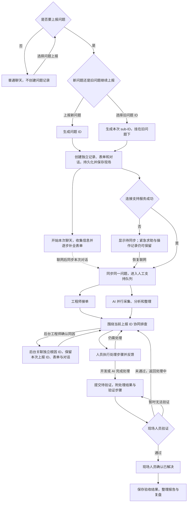

# 现场问题统一支持入口：用户旅程

> 历史草案。交互、三态 Bug 流程与飞书人工接管以 [软件设计需求文档](software-design-requirements.md) 为准；本文保留作早期讨论记录。

版本：v0.7｜日期：2026-09-11｜状态：详细设计草案

本文明确用户行为、页面反馈、角色交接和完成条件，作为下一步需求设计的依据。技术架构、接口和实现方案后续展开。

## 1. 已确定的产品方向

现场人员通过统一入口获得帮助，逐步迁移原来在飞书中临时找工程师的求助方式。第一阶段预计约 95% 的问题仍由人工主导解决；这是初期假设，不设成人工或 AI 的处理配额。优先保证求助效率，同时完整记录问题及处理过程，逐步减少工程师支持投入。

- 现场环境为 Linux 工控机或机器人，涉及 Python、ROS 和本仓库软件。
- 接受任意现象报障，不要求人员选择准确的故障类型。
- 进入对话前先选择“是否要上报问题”。选择【否】进入普通聊天；选择【是】后，可【上报新问题】生成问题 ID，也可【选择旧问题继续上报】生成 sub-ID。先生成 ID，再开始本次聊天、采集信息并补全表单。
- 每次上报都有独立数据库记录、表单、对话和处理状态；后续线索归入本次上报 ID。选择旧问题继续上报时，新记录挂在所选问题下，原记录保留。
- 本阶段不做后台异常检测。人员明确上报并生成本次 ID 后，才为本次问题保存故障快照、组织证据并启动后续诊断；平时的日志和运行记录按约定持续保存。
- 多条上报记录经后台工程师确认由同一个 root cause 导致后，可以归到一个独立的根因 ID 下。AI 可以向后台工程师建议关联，但不自动改变归属；现场人员无须处理根因，也没有相关操作权限。
- 问题按 Bug 管理流程推进：开发人员或 AI 完成处理后提交【待验证】，最后由现场人员验证并确认【已解决】。验证失败返回【处理中】，暂时无法验证则保留【待验证】。
- 网络可能不稳定。本地先保存，联网后同步、调用 Codex 分析和请求补采。
- AI 可采集、查询、分析、给出建议。现场的软件修改、重启、模式切换和设备动作由人员执行。
- 本地采集程序在断网时仍工作；模型分析不承诺离线可用。
- 第一版中，人工支持与 AI 分析并行，人工接手不以 AI 排查完成为前提。

## 2. 角色与成功标准

| 角色 | 来这里做什么 | 成功标准 |
|---|---|---|
| 现场人员 | 描述问题、获得帮助、执行步骤、验证并确认【已解决】 | 不用整理技术材料即可报障；知道谁负责、下一步做什么，并掌握最终验收确认 |
| 开发人员／支持工程师 | 接单、判断原因、修复或指导处理、提交【待验证】 | 接手即有上下文；能自主读证据和让 AI 补查；处理后给出现场验证方法 |
| 支持协调人／复盘负责人 | 处理无人接单、分派和转交、跟进问题、复盘 | 每件问题都有归属；知道重复发生、长期未修复和支持成本在哪里 |
| AI 助手 | 采集分析、补问与补查、在职责范围内完成处理、提交【待验证】、整理报告 | 提供有来源的判断和处理结果；减少人工投入，最终验收交给现场人员 |

团队初期可以由同一位工程师兼任接单、处理和复盘角色，不要求先建立复杂的组织分工。

## 3. 问题 ID、每次上报与根因分组

**先选择是否上报，再生成 ID，之后开始聊天。**人员进入支持入口，先选择“是否要上报问题”。选择【否】进入普通聊天，不创建问题记录或问题表单；选择【是】后，有两条路径：

- 【上报新问题】：立即生成问题 ID，例如 `R-001`，同时创建首次上报的独立记录、表单和专属对话。
- 【选择旧问题继续上报】：选择已有问题 ID，例如 `R-001`，立即为这一次上报生成 sub-ID，例如 `R-001-001`，创建新的独立记录、表单和专属对话，并挂在 `R-001` 下。再次选择该问题上报时生成另一个 sub-ID，例如 `R-001-002`。

ID 创建成功即明确了本次上报的开始，初始状态为【待处理】。随后通过聊天描述现象、收集证据、逐步补全表单，无需先填写或提交表单，也不设置等待首条现象提交的草稿阶段。新问题 ID 同时标识首次上报；sub-ID 标识旧问题下的一次新增上报。下文“当前上报 ID”指本次的新问题 ID 或 sub-ID，每一个都对应独立的数据库记录。离线时先本地持久化，联网同步与重试继续使用同一 ID。

**继续对话与再次上报是两个操作。**从列表打开某次上报，选择【继续对话】，沿用该次 ID，不新建记录。选择【继续上报】则进入“是否要上报问题”的明确选择，并预选所属旧问题；确认后创建 sub-ID。选择已有 sub-ID 对应的问题时，新上报仍挂在所属问题 ID 下，不逐层嵌套。旧问题的历史材料可以供本次排查参考，但本次消息、采集和验证记录保存在新的 sub-ID 下。

每天的上报按各自的发生／上报时间独立保留，可以按天查看和统计。跨天继续同一次对话时仍沿用原 ID；新一次上报生成新问题 ID 或新的 sub-ID。日期相同、选择同一旧问题或现象相似，都不会合并、覆盖原记录。

**后续线索围绕本次上报收敛。**现场与工程师的消息、AI 分析、工具查询结果、终端和日志、附件、操作反馈、修复与验证均绑定当前上报 ID。表单呈现结构化信息，对话保留完整处理经过，两者属于同一次上报。页面持续展示当前上报 ID；如果是 sub-ID，同时展示所属问题 ID，并可切换查看该问题的其他上报。

**人工上报是本阶段的唯一问题入口。**普通聊天中可以随时选择【问题上报】，进入上述流程；在人员明确选择前不创建问题或触发问题取证。本阶段不提供后台异常检测，也不依据异常自动触发故障快照或建单。常规日志和运行记录持续保存，供人工上报后读取和关联。

每次上报对应一份表单，由聊天、采集和处理过程逐步补全；信息不足时标记待补充，不阻止建档和支持：

| 表单内容 | 产生或维护方式 |
|---|---|
| 当前上报 ID、所属问题 ID、创建／上报时间、上报人 | 在聊天开始前生成 ID；新问题的两项 ID 相同，继续上报时分别为 sub-ID 和所选旧问题 ID；身份和时间自动填入 |
| 工作站、设备、运行方案、版本 | 自动关联；无法获取时允许补充 |
| 现象、发生时间、预期行为、影响程度 | ID 生成后通过聊天逐步收集，AI 辅助整理；未知项标记待补充，人员可修正 |
| 负责人、处理状态、当前下一步 | 随接单、协作和验证更新 |
| 对话、证据、附件与操作记录 | 自动关联到当前上报 ID，引用历史材料时保留原始来源 |
| 原因判断、处理办法、修复／部署版本、验证步骤 | 开发人员或 AI 提交，随处理补全 |
| 验证结果、现场确认人、确认时间和证据 | 现场人员验证后记录，确认通过才转为【已解决】 |
| 根因 ID（root_cause_id） | 后台工程师维护的内部字段；现场表单不展示，也不要求现场填写 |
| hotfix、提交及外部研发工单链接 | 按实际修复情况补充，关联到当前 Bug 处理记录 |

**根因分组是后台工程师的内部工作。**后台工程师确认多次上报由同一个 root cause 导致后，建立或选择根因 ID（`root_cause_id`），集中跟踪根因、影响范围、修复和验证。选择旧问题生成 sub-ID 只表达本次上报挂在已有问题下；同一 root cause 的技术结论不会自动继承，仍须由后台工程师确认。根因分组可以汇集不同问题 ID 及其 sub-ID 对应的上报，具有自己的根因说明、判断证据、负责人和修复进度，各次上报仍独立保留。

**根因权限只开放给后台工程师。**AI 可在后台工作台展示历史上报、候选根因与匹配依据，后台工程师确认后才能选择【关联根因】、新建根因分组、取消关联或更正关联。仅现象相似时保持未归因；表现不同但经后台工程师确认同因的记录，也可以归入同一根因分组。现场页面不展示根因 ID、候选根因或【关联根因】入口，现场人员只处理本次上报、执行步骤和最终验收。

以下编号和现象为说明关系的示例：

| 上报日期 | 本次上报 ID | 所属问题 ID | 上报方式与现象 | 后台工程师确认后的根因 ID |
|---|---|---|---|---|
| 9 月 11 日 | R-001 | R-001 | 上报新问题：设备 A 操作无响应 | RC-001 |
| 9 月 12 日 | R-001-001 | R-001 | 选择旧问题继续上报：设备 A 再次无响应 | RC-001 |
| 9 月 12 日 | R-001-002 | R-001 | 选择旧问题继续上报：类似现象，原因仍待查 | 未关联 |
| 9 月 12 日 | R-002 | R-002 | 上报新问题：设备 B 异常，后确认同因 | RC-001 |

`R-001` 的上报列表包含首次记录和两个 sub-ID；分别打开后，可查看各自的表单、发生时间、证据、对话和处理状态。后台工程师的 `RC-001` 页面汇集经确认同因的 `R-001`、`R-001-001`、`R-002`，不自动包含尚未确认的 `R-001-002`。继续回复 `R-001-001` 时，消息仍绑定 `R-001-001`，不创建新 sub-ID。示例编号仅表示关系，实际编号须支持离线唯一生成，需求与架构阶段确定格式。

按天统计时，示例共四次上报、两个问题 ID、两个 sub-ID 和一个根因分组；每次上报只计一次，问题入口和根因聚合不额外计为上报。

后台工程师的关联操作保存操作者、时间和判断依据，误关联也仅由后台工程师更正。关联根因不自动将任何一次上报标为【已解决】。同一修复可由开发人员或 AI 提交给相关上报，使具备验证条件的记录进入【待验证】，每条记录由对应现场人员独立验收。根因分组依据关联上报的现场验证结果汇总状态，仍有未解决记录时不整体标记【已解决】；之后新增同因上报时继续跟进，并核对版本、部署与修复情况。

**Bug 管理以现场验收为完成条件。**每条上报通过【待处理 → 处理中 → 待验证 → 已解决】跟踪。开发人员或 AI 完成处理后，记录处理办法、相关版本和验证步骤，再提交【待验证】；现场人员验证通过后确认【已解决】。开发自测通过、AI 给出答案、现场临时恢复或根因已关联都不能代替现场确认。处理方法、验证结果和适用条件沉淀在同一记录中，供后续复盘与复用。根因可属于软件、配置、操作或环境问题；需要外部研发协作时保留工单链接。

## 4. 主旅程

### 阶段 0：日常运行，求助入口始终可用

**现场体验**：在本机打开支持入口，看到当前工作站、运行方案、采集状态和联网状态，先选择“是否要上报问题”。选择【否】可普通聊天，之后也能通过【问题上报】进入上报流程。已有问题列表提供【继续对话】和【继续上报】两个入口，分别用于补充原记录和创建新的 sub-ID。设备或方案无法自动识别时允许人工指定，不阻止先建档。

**日常记录**：持续保留滚动日志、终端输出及已配置的关键事件和指标，记录本次启动的版本与配置；这些记录只用于后续取证，本阶段不据此开展后台异常检测或自动报障。控制程序未启动或异常退出时，支持入口和本地采集服务仍可使用，由人员选择【问题上报】启动问题处理。未采集到的内容明确标记；整个主机宕机时本机入口不可用，由远程人员或其他设备通过【问题上报】先建立问题，主机恢复后补充现场证据。

**体验要求**：入口展示自身的记录保存、采集可用性和联网状态；业务软件故障由人员描述，上报后再结合证据诊断。支持页面可访问不代表历史证据完整，缺失内容需明确标注。

### 阶段 1：明确上报，先生成 ID，再开始聊天

**现场动作**：先回答“是否要上报问题”。选择【是】后，选择【上报新问题】，或查找并选择旧问题 ID【继续上报】。系统先显示生成的问题 ID 或 sub-ID，然后进入本次专属聊天，现场再描述“刚才切换后没有反应”。描述、图片、终端片段可以逐步补充。发生时间未知时记录为大致时间，不强迫填写精确时间、日志路径或故障分类。

**后台动作**：在人员选定新问题或旧问题后，立即分配本次 ID、创建独立表单和对话，以【待处理】状态持久化到数据库，并保存此前可用的滚动记录和当前快照。选择旧问题时同时记录所属问题 ID，不覆盖旧表单和旧对话。离线时先写本地记录，联网后同步。建档、取证和支持队列同步不等待首条消息或模型理解文本；信息随后从聊天与采集中补全。

**页面反馈**：本地保存成功后展示当前上报 ID、保存时间和聊天入口，现象字段暂显示“待补充”；sub-ID 页面同时显示所属问题 ID。远端接收成功后显示“已进入支持队列”。区分“正在保存”“已在本机保存”“已同步”，保存失败时给出真实失败状态和备用求助方式。

**聊天中优先收集的信息**：实际现象、预期行为，以及影响程度，例如“工作中断”“功能异常但可继续”“已恢复，记录待查”。设备和时间尽量自动填入。这些信息用于排查，不作为创建 ID 的前置必填项。旧问题的摘要、已尝试步骤和历史修复可供参考，本次发生时间、设备、版本和表现重新收集，避免将历史情况当作当前事实。

**完成条件**：本次 ID、独立记录、表单和对话已建立，证据采集已经启动，现场可以开始聊天，并知道当前上报是否已送达支持端。创建后尚未聊天的记录仍保留【待处理】，提示待补充现象。

### 阶段 2：进入队列，人工和 AI 同时开始

**人工路径**：新生成的上报记录同步到远端后进入预设的支持队列，协调人或值班工程师能立即看到。尚未收到现象时显示“待补充现象”，可直接在该次对话中追问；分派和通知不等待表单填完、完整日志上传或 AI 得出结论。飞书可作为通知渠道，通知包含当前上报 ID，链接指向该次记录；sub-ID 同时展示所属问题 ID。通知发送、送达和工程师接单分别记录。

**AI 路径**：联网后先读取现象和已到达的证据，整理时间线、缺失信息和初步检查结果；大体量附件可以继续同步。AI 分析不可用时显示状态，人工仍可读取原始材料并处理。

**现场看到**：当前为“等待工程师接单”或“工程师处理中”，以及独立的证据同步进度和 AI 状态。只有真实接单后才显示具体负责人，不把消息通知成功视为已经有人处理。

**无人接单时**：达到团队配置的响应阈值后通知备用支持人或协调人；页面展示真实等待状态和紧急联系路径。响应阈值、支持时段和轮值人员在试点前配置，不在产品中承诺未经团队验证的到达时间。

### 阶段 3：工程师接单，快速建立上下文

**工程师入口**：从后台队列或通知打开本次上报，点击“接手”。首屏集中显示当前上报 ID、表单摘要、现象、影响、设备、发生时间、版本、是否仍在发生、现场联系人和关键证据摘要；sub-ID 同时展示所属问题及历史上报入口，后台工程师可查看已归因的根因 ID 和说明。

**工程师操作**：直接进入同一个问题对话；需要时展开完整日志、终端历史、配置和代码引用。可以要求 AI 继续查询特定时间段、节点或代码路径，也可自行作出判断。

**现场看到**：“某工程师已接手”，随后收到必要的追问或下一步指导。工程师不再要求现场重复粘贴页面上已有的信息。

**负责人规则**：一位主负责人保持对本次问题的责任，其他工程师可以协作。转交时记录原因、下一步和已排除的方向；新负责人确认接手前原负责人继续负责。根因关联仅由后台工程师操作，与负责人转交分别记录。

### 阶段 4：在同一问题页协同排查

**现场体验**：现场和工程师使用当前上报 ID 下的同一对话，消息明确标识“现场人员”“工程师”“AI 助手”。AI 采集状态和大量中间输出放在证据区，重要发现以简短结论呈现。处理其他上报时显式切换到对应记录；再次报障选择【问题上报】，决定新建问题还是在旧问题下生成 sub-ID。

**AI 工作**：关联终端、日志、进程、设备、ROS 状态与现场版本代码；区分已确认事实、待验证假设和缺失证据。每条发现可以展开原始证据及采集时间。现场仍在线时，AI 通过限定的工具补查当前状态；无法连接时列出待采集项，并据已保存材料继续分析。

**第一版协作规则**：AI 优先向工程师提供诊断与处置草稿；工程师确认后，作为明确的处理步骤发送给现场。AI 可以直接回答事实查询、解释证据和给定步骤，不同时向现场发出另一套操作指令。

**提交验证**：开发人员或 AI 完成职责范围内的处理后，可以将问题推进到【待验证】，附上处理结果和验证步骤。状态流转不扩大 AI 对现场设备和软件的操作权限；现场修改与设备动作仍由人员执行。

**日志不足时**：读取仍保留的终端内容和其他现场证据；定位代码中的观测缺口；给出要补查的信号及用途。必须增加日志、改变配置或重新运行时，由工程师决定并由人员执行。

**发现相似问题时**：AI 在后台工程师工作台搜索历史上报和根因，展示现象、证据和适用版本供判断。后台工程师确认同因后，通过【关联根因】选择已有根因 ID，或新建根因分组并归入相关上报，留下关联依据。本次表单和对话继续使用原上报 ID，后台根因页汇集相关记录；相似度本身不触发自动归属。现场侧不展示这项判断或操作。

**完成条件**：形成一个明确的待验证判断，以及现场能执行、能反馈的下一步。

### 阶段 5：人员执行步骤，系统记录结果

一条处理步骤包括：目的、具体操作、预期现象，以及失败或不符合预期时如何反馈。一次给出现场可消化的少量步骤。

**现场动作**：选择“已执行”“执行失败”或“暂时无法执行”，补充观察结果、文字或图片。执行检查命令、重启、模式切换、代码或配置修改均由人员完成。AI 的诊断命令在独立的受限采集环境中运行，不向业务终端输入控制指令。

**后台动作**：按当前上报 ID 保存步骤、发布者、执行者反馈和时间，同步更新本次表单；追加允许采集的状态，便于比较操作前后。系统采集到的事实与人员自述分开保留。网络中断期间的反馈先写本地，联网后同步。

**工程师操作**：根据结果继续排查、修正假设或给出下一步。AI 维护已尝试步骤和已排除方向，帮助新加入的人接上进度。

**现场修改的关联**：如工程师实施 hotfix，记录所属分支、提交、实际部署版本和验证结果。现场使用临时未提交代码时保留差异，并追踪补提交情况。

### 阶段 6：开发人员或 AI 完成处理，提交【待验证】

**处理方动作**：开发人员或 AI 完成修复、配置处置或其他解决步骤后，选择【提交验证】。记录处理说明、相关提交／配置／版本、实际执行或部署情况，以及现场验证步骤和预期结果。仅提出尚未验证的原因假设时继续排查；依赖的现场修改或部署尚未完成时，明确剩余动作。

**系统动作**：记录提交方和时间，将本次上报设为【待验证】，在现场人员的问题列表和详情页呈现待验证事项。交付信息和采集证据继续绑定当前上报 ID，AI 是否已完成分析单独展示。

**临时恢复**：现场可以反馈当前已恢复运行，并继续工作；这是现场运行情况，不直接改变 Bug 的验收结果。若处理尚未完成，问题保持【处理中】；处理已完成并提交验证后保持【待验证】，直到现场验收。

**完成条件**：现场清楚处理了什么、怎样验证，问题具有明确的【待验证】状态。开发人员和 AI 均不能替现场确认【已解决】。

### 阶段 7：现场验证，确认【已解决】或退回处理

**现场动作**：按处理方提供的步骤验证实际业务行为，并在当前问题页选择以下结果：

- 【已解决】：验证通过，现场人员明确确认，记录确认人、时间、验证结果及相关证据。
- 【验证未通过】：填写仍存在的现象，退回【处理中】，开发人员或 AI 在同一上报 ID 和对话下继续处理，不创建 sub-ID。
- 【暂时无法验证】：说明原因，保持【待验证】，后续继续原验证事项。

**确认规则**：最终【已解决】只能由负责验收的现场人员确认，开发人员／支持工程师和 AI 不能代替。无回复、超时、自动检查通过和代码合并均不自动完成验收。长时间待验证可以提醒和协调，但仍保留未验收状态。

**记录与复盘**：AI 根据该问题的对话、处理结果和现场确认整理报告、补全表单，工程师核对原因和技术说明。现场确认后即完成该条 Bug 的解决流程，报告整理不改变验收状态，也不再增加一个工程师关闭步骤。根因分组继续分别展示各次上报的验证结果。

**再次发生**：现场确认【已解决】后，后来又出现异常时，重新选择【问题上报】；可选择旧问题 ID，生成新的 sub-ID，也可上报为新问题。历史上报的验收结果保留，本次新记录从【待处理】开始；后台工程师根据需要判断是否属于同一根因。旧问题尚在处理时也可生成 sub-ID 记录新一次上报；只补充当前处理线索或反馈验证失败时，继续原记录，不新建 sub-ID。

### 阶段 8：复盘，并逐步扩大 AI 能力

**复盘负责人／后台工程师**：可按日期查看每天独立入库的上报，按问题 ID 查看首次上报及后续 sub-ID，也可围绕根因 ID 汇总后台确认同因的多次上报，查看影响设备和版本、每次支持投入、修复进度、证据缺口和重复的排查动作。汇总报告能展开每次上报自己的 ID、表单、对话和证据；尚未确认归因的相似上报保留为未关联记录。根因视图不对现场人员开放。

**工程师与 AI**：从现场已确认【已解决】的记录中整理可复用的排查路径，写清触发现象、必要证据、适用版本、操作步骤、失败时升级条件和验证方法。保留技术核对过程，代表性案例可用于离线评估；一个现场验证通过仅证明对应条件下的结果，不能直接扩大为所有设备或版本都适用。

**后续演进**：先允许 AI 处理证据充分、路径经过验证的问题，人员仍执行实际操作；未知或未验证问题继续人工主导。是否扩大范围由正确率、恢复效果、重复求助和工程师投入共同决定。

## 5. 页面与操作入口

| 页面／区域 | 服务角色 | 首要内容与操作 |
|---|---|---|
| 现场首页 | 现场人员 | 当前设备、联网与采集状态、“是否要上报问题”的【是／否】选择、普通聊天、我的问题 |
| 上报入口 | 现场人员、代报人员 | 【上报新问题】或【选择旧问题继续上报】、旧问题搜索和摘要；选定后立即生成问题 ID 或 sub-ID，再进入聊天 |
| 问题上报列表 | 现场人员、工程师 | 问题 ID、首次上报及各 sub-ID、各次发生时间和状态、【继续对话】与【继续上报】 |
| 本次上报详情：表单、对话与下一步 | 现场人员、工程师 | 当前上报 ID、所属问题 ID、表单摘要、现象、影响、负责人、处理状态、专属对话、处理步骤、【提交验证】、现场【已解决／验证未通过／暂时无法验证】 |
| 问题详情：证据与分析 | 后台工程师；现场人员可查看与本次处理相关的摘要 | 时间线、日志、终端、配置、代码引用、采集完整度、AI 假设与待查项；根因关联信息不在现场侧展示 |
| 支持队列 | 工程师、协调人 | 当前上报 ID、所属问题 ID、等待时间、现象或待补充提示、影响程度、设备、负责人、接手、转交、等待现场反馈的上报 |
| 待验证列表 | 现场人员 | 【待验证】问题、处理说明、修复版本、验证步骤、预期结果和验收反馈入口 |
| 根因归属与关联上报 | 后台工程师 | 查找历史上报与根因、【关联根因】、新建根因分组、关联依据、各次表单与对话、取消或更正关联；现场无入口和权限 |
| 问题跟踪与复盘 | 后台工程师、复盘负责人 | 每日独立上报、同一问题的首次上报及 sub-ID、同一根因 ID 下的多次上报、修复和部署版本、现场确认结果、验证退回记录、支持投入 |

上报详情始终围绕当前上报 ID 和对应表单组织，选择旧问题或关联根因后仍可定位本次上报。每个新问题的首次上报、每个 sub-ID 都是一条独立数据库记录；问题列表汇集其历次上报，根因分组另有自己的 ID 和记录。外部问题表可以作为表单呈现或跟踪工具，与独立上报 ID 保持一一对应，同步重试不重复建表单。

## 6. Bug 状态流转与操作角色

每次上报的流程为【待处理 → 处理中 → 待验证 → 已解决】。生成 ID 并成功保存记录后即为【待处理】，适用于新问题的首次记录和每个 sub-ID；现象待补充不另设草稿状态。

| 当前状态 | 操作／条件 | 操作角色 | 下一状态 |
|---|---|---|---|
| 尚未建档 | 明确选择上报，选定新问题或旧问题，生成本次 ID 并成功保存 | 现场人员；代报时记录来源 | 待处理 |
| 待处理 | 接手并开始处理 | 开发人员／支持工程师；后期可由 AI 承担已允许的处理范围 | 处理中 |
| 处理中 | 完成处理，附处理结果和验证步骤，选择【提交验证】 | 开发人员或 AI | 待验证 |
| 待验证 | 验证通过，明确确认【已解决】 | 现场人员 | 已解决 |
| 待验证 | 选择【验证未通过】，补充现象 | 现场人员 | 处理中 |
| 待验证 | 选择【暂时无法验证】，或尚未反馈 | 现场人员反馈／尚待反馈 | 待验证 |

验证退回与再次提交验证都记录时间、人员、处理版本和结果。继续对话和验收反馈沿用本次 ID；选择旧问题继续上报时创建新的 sub-ID，从【待处理】开始。各次上报独立验收，一条【已解决】不自动解决其他 sub-ID。新增 sub-ID 不覆盖首次上报的历史验收结果，问题列表汇总展示各次状态及未解决数量。

其他状态作为独立信息展示：

| 状态维度 | 用户可见示例 | 不能误表达的含义 |
|---|---|---|
| 支持进展 | 等待接单、负责人、等待现场补充信息 | 不替代 Bug 状态；等待补充信息不等于已提交验收 |
| 现场运行情况 | 仍有异常、临时恢复、暂时无法观察 | 临时恢复不等于现场确认【已解决】 |
| 证据与同步 | 本地已保存、待同步、部分已同步、同步完成、保存或同步失败 | 本地保存不等于工程师已收到；部分同步不等于证据完整 |
| AI 进度 | 等待联网、分析中、待补充证据、已有建议、暂不可用 | AI 完成分析不等于故障已经解决 |
| 所属问题 | 首次上报 R-001、后续上报 R-001-001 | 挂在旧问题下不代表已确认同因，也不继承旧记录的验收状态 |
| 根因归属（仅后台） | 未关联、已归入根因 RC-xxx | 后台工程师归因不改变本次上报 ID、表单、对话或验收状态；现场不显示该维度 |
| 根因跟进进度（仅后台） | 处理进展、各次上报的待验证／已解决情况 | 由关联记录汇总；存在未解决上报时不整体标为【已解决】 |
| 外部研发工单进度 | 外部工单的实际状态 | 外部工单完成不代替本系统的现场验收 |

没有证据时标记为未知或未采集；区分事件发生时间、设备记录时间、采集时间和上传时间。保留原始记录与来源，AI 摘要支持追溯，不覆盖原始证据。

## 7. 必须走通的异常旅程

| 情况 | 现场体验 | 支持侧处理 |
|---|---|---|
| 报障时断网 | 明确上报后本地生成问题 ID 或 sub-ID，建立表单并开始聊天，展示待同步；紧急时联系人工 | 联网后同步同一 ID、表单和对话，电话或飞书支持过程补入该次记录 |
| 离线查不到旧问题 | 可选择本地已有的旧问题；完整 ID 已知时允许先记录该 ID 并创建 sub-ID，显示所属关系待核验；找不到或不知道 ID 时可先上报新问题 | 联网后核验所属关系；无法匹配时提示人工更正，保留本次 ID 和已收集材料 |
| 上传大附件时断网 | 小型描述与状态按实际同步结果展示，未完成附件标为待传 | 工程师用已到材料先处理，不等待完整附件 |
| 本机完全宕机 | 从其他设备选择【问题上报】，或由支持人员代为上报，不承诺本机继续采集 | 保留独立问题 ID、表单和代报来源；重启后补充证据，丢失时间段明确标注 |
| 程序启动失败 | 支持入口仍可用，启动前输出也可进入证据 | 工程师读取启动快照，AI 辅助定位失败阶段 |
| 问题已经自行消失 | 仍可报障，记录临时恢复和大致发生时间 | 用历史证据继续处理；自行消失不直接转【已解决】 |
| 没有充分日志 | 能提交终端文本、截图和现象，无需先补齐技术材料 | 读取现有证据，查询当前状态，明确缺口与下一次观测方案 |
| AI 超时、错误或不可用 | 人工支持继续；看到真实的 AI 状态 | 工程师直接处理，错误建议可被纠正并记录，不作为已确认结论 |
| 长时间无人接单 | 展示等待状态和紧急联系入口 | 按团队响应策略升级到备用支持人或协调人 |
| 工程师转交／换班 | 同一上报 ID 下持续处理，看到新的负责人 | 新负责人读取表单、时间线、已尝试步骤和待验证假设，确认接手 |
| 现场暂时无法操作 | 可以选择暂时无法配合，并说明原因 | 保留待办与责任人；处于【待验证】时继续等待现场验收 |
| 开发／AI 已完成处理 | 现场看到【待验证】以及处理说明和验证步骤 | 交给现场验收，开发／AI 不直接标记【已解决】 |
| 现场验证未通过 | 反馈剩余现象，原问题退回【处理中】 | 在原 ID 下继续处理，保留本轮处理与验证记录 |
| 待验证长期无反馈 | 可说明暂时无法验证 | 提醒并协调验证时间，不因超时或工程师判断改为【已解决】 |
| 类似现象再次出现 | 选择【问题上报】，可选择旧问题生成新的 sub-ID，或上报为新问题；本次表单和对话独立入库 | 后台工程师查看历史材料并收集本次现场，确认同因后关联根因 ID；挂在旧问题下不自动完成归因 |
| 多人报同一次故障 | 可选择同一个旧问题，各次生成独立 sub-ID；已分别新建问题的记录也保留 | 后台工程师标记重复上报并协调处理；确认根因后可归到同一根因 ID，各次记录仍独立保留 |
| 选择不上报／普通聊天中提到现象 | 不创建问题记录；需要上报时显式选择【问题上报】，生成 ID 后开始该次对话 | AI 不自行创建或拆分问题，也不触发问题取证 |
| 已创建 ID 但尚未描述现象 | 已有本次记录，显示【待处理】和“待补充现象”，可随时回来继续聊天 | 已同步记录正常可见，支持人员可以追问，不等待提交表单才接单 |
| 只需补充原上报 | 打开具体问题 ID 或 sub-ID，选择【继续对话】，不生成新 sub-ID | 新线索继续绑定该次记录；【继续上报】才表示新增一次上报 |
| 根因关联错误 | 现场无须处理，也不显示根因关联 | 后台工程师可更正或取消关联，保留变更记录，各次上报 ID、表单、证据和对话不丢失 |
| 跨天处理 | 从原记录继续对话，保留原上报 ID | 按日期查看上报与进展；跨天不拆分原记录，新一次问题上报另建记录 |

## 8. 第一版验收关注什么

1. 先选择“是否要上报问题”：选择【否】进入普通聊天；选择【是】后选定新问题或旧问题，先生成问题 ID 或 sub-ID，再开始本次聊天与信息收集，表单逐步补全。创建不依赖首条现象、表单提交或模型响应；本阶段不做后台异常检测，普通聊天和常规记录不自动触发故障快照或建单。
2. 无需等待 AI，工程师即可接单并开始处理；工程师知道已到与缺失的证据。
3. 终端无日志、程序退出、网络中断时仍有对应的可用路径，且不伪造历史证据或送达状态。
4. 本次上报后的所有对话、采集、操作、反馈、验证退回和现场确认【已解决】均绑定当前上报 ID，并可从对应表单追溯；继续原对话不新建记录，选择旧问题继续上报生成新的 sub-ID，页面明确显示当前记录及所属问题。
5. 首次上报和每个 sub-ID 独立入库，保留自己的表单、对话和处理状态；选择旧问题不覆盖历史记录或继承其验收状态。根因的创建、关联、取消和更正只允许后台工程师操作，AI 仅提供建议；现场页面不展示根因字段或入口，归因不改变验收结果。
6. AI 能完成材料整理、补查和报告草稿，工程师只需核对关键内容。
7. 统计首次有效人工响应时间、恢复时间、每单工程师投入、补问次数、待验证时长、验证退回、重复发生和重新求助情况。自动确认消息不计为有效人工响应，进入【待验证】不计为已解决；AI 独立解决统计还需结合处理贡献和现场确认。
8. 离线同步与重试不重复创建 ID 或表单；更正关联不丢失原记录；现场临时恢复、根因处理和最终验收分别表达。
9. 可按天查看独立上报，按问题 ID 查看首次上报及各 sub-ID，按根因 ID 查看跨日期、跨设备的同因记录；上报次数、问题数量、重复上报和根因分组数量分别统计，聚合页不额外计为上报。
10. 开发人员或 AI 完成处理后只能推进到【待验证】，最终由现场人员确认【已解决】；验证失败返回【处理中】，未验证保持【待验证】，根因分组不批量替代现场确认。

## 9. 进入需求设计时沿用的假设

- 第一版的主要交互为本机支持页面和工程师支持页面，两方围绕同一上报 ID、表单与对话协作；本机不可用时有备用报障途径。
- 上报以“是否要上报问题”的显式选择开始；选择上报后，新问题生成问题 ID，旧问题继续上报生成 sub-ID，然后开始聊天和收集信息，每次独立入库。【继续对话】沿用已有记录，表单填写不作为建档的前置条件。
- 根因分组沿用独立 ID；旧问题下的 sub-ID 表达上报归属，同因结论、创建根因分组和关联操作仅由后台工程师完成，AI 仅建议关联。现场侧没有根因字段、页面或操作权限，外部研发工单不作为根因归属的前置条件。
- 本系统按 Bug 流程管理这些记录，开发人员或 AI 提交【待验证】，现场人员最终确认【已解决】；处理经验从这些记录中沉淀。
- 飞书先承担通知和紧急求助辅助角色，问题的主要对话与记录集中到统一入口；具体对接后续设计。
- 初期人工默认接单，AI 为工程师提供分析和处置草稿；本阶段不做后台异常检测，问题取证由人工【问题上报】触发，上报后的补采限定在约定范围内。
- 支持时段、主备负责人和响应阈值由团队配置；工单系统、页面入口位置和最终存储策略在需求与架构阶段确定。
- 本文的状态和页面名称为设计提案，尚未表示系统已经实现。
